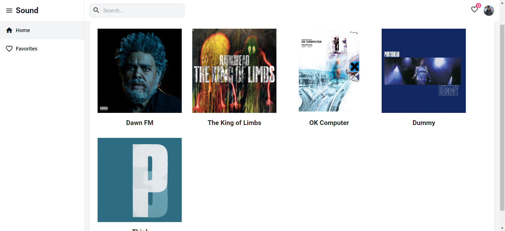
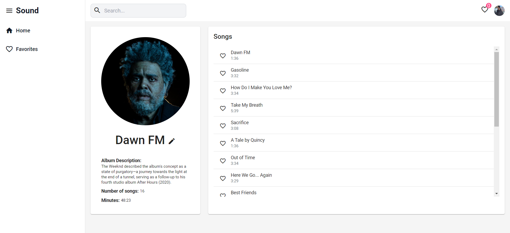
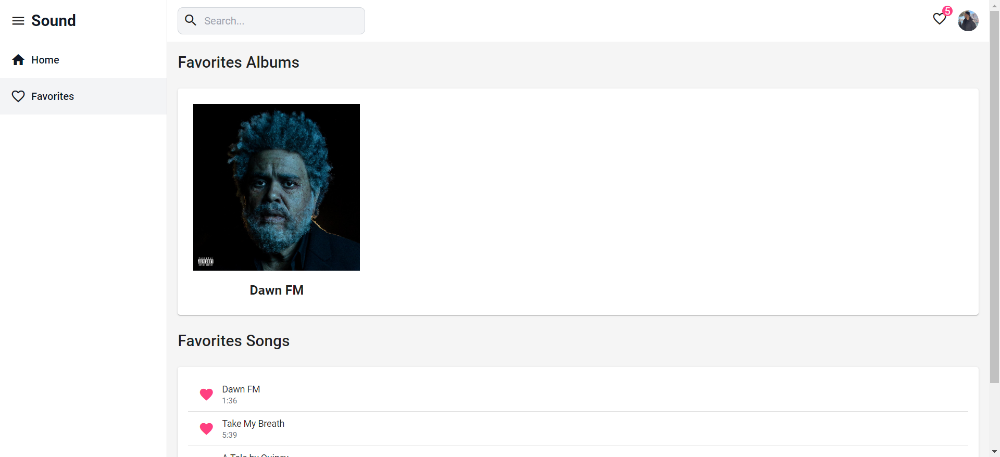

# Sound

Este projeto foi gerado com [Angular CLI](https://github.com/angular/angular-cli) versão 17.1.3.

## Sobre o Projeto

Este projeto é uma aplicação web para gerenciamento de albums e músicas.

## Funcionalidades

- Adicionar/editar album
- Adicionar/editar músicas
- Adicionar/remover albums e músicas dos favoritos.

## Instruções de Instalação

1. Clone o repositório
2. Navegue até a pasta do projeto
3. Execute `npm install` para instalar as dependências
4. Execute `ng serve` para iniciar o servidor de desenvolvimento
5. Navegue até `http://localhost:4200/`

## Screenshots

